# Add `ngay_ngung_su_dung` Column to `thiet_bi` Table

## Goal

Add a new column `ngay_ngung_su_dung` (Ngày ngừng sử dụng — "Date Decommissioned") to the `thiet_bi` table to record when a device ends its lifecycle.

## Business Rules (Confirmed by User)

> [!IMPORTANT]
> 1. **Strict DD/MM/YYYY format**: Unlike other date fields (which accept partial dates like MM/YYYY or YYYY), `ngay_ngung_su_dung` requires exact `DD/MM/YYYY` format
> 2. **Cross-field validation**: `ngay_ngung_su_dung >= ngay_dua_vao_su_dung` (can't decommission before commissioning)
> 3. **Auto-set (UTC+7)**: When `tinh_trang_hien_tai` changes to `"Ngưng sử dụng"`, auto-populate with today's date in Vietnam timezone (user can edit afterwards)
> 4. **Hidden by default** in the equipment data table (user can toggle visibility)
> 5. **No backfill**: Existing records with `tinh_trang_hien_tai = "Ngưng sử dụng"` keep `ngay_ngung_su_dung = NULL`

---

## State Machine: Data Flow & Blast Radius

```mermaid
stateDiagram-v2
    direction TB

    state "1. DATABASE" as DB {
        Supabase_Migration: ALTER TABLE thiet_bi<br/>ADD ngay_ngung_su_dung TEXT
    }

    state "2. TYPE DEFINITIONS" as Types {
        database_ts: types/database.ts
        data_ts: lib/data.ts
    }

    state "3. DATE UTILS" as DateUtils {
        text_date_fields: date-utils.ts → TEXT_DATE_FIELDS
        partial_date_fields: equipment-table-columns.tsx → PARTIAL_DATE_FIELDS
    }

    state "4. IMPORT / EXPORT" as ImportExport {
        excel_utils: excel-utils.ts → COLUMN_LABELS + template
        import_dialog: import-equipment-dialog.tsx → headerMap + dateFields
    }

    state "5. UI FORMS (3 dialogs) + Validation" as UIForms {
        add_dialog: add-equipment-dialog.tsx
        edit_dialog: edit-equipment-dialog.tsx
        detail_types: EquipmentDetailTypes.tsx → schema
        detail_form: EquipmentDetailEditForm.tsx → field
        detail_index: EquipmentDetailDialog/index.tsx
        note1: 🔑 .superRefine() for cross-field validation
        note2: 🔑 watch(tinh_trang_hien_tai) → auto-set date
    }

    state "6. TABLE & DISPLAY" as Display {
        table_cols: equipment-table-columns.tsx → columnLabels
        table_hook: useEquipmentTable.ts → visibility=false
        print_utils: equipment-print-utils.ts → HTML
    }

    state "7. AI LAYER" as AI {
        troubleshoot: troubleshooting-schema.ts
        repair_draft: repair-request-draft-schema.ts
        system: system.ts → prompt
    }

    state "8. TESTS" as Tests {
        crud_test: equipment-dialogs.crud.test.tsx
        import_val: import-equipment-validation.test.ts
        import_dlg: import-equipment-dialog.test.tsx
        qr_test: qr-action-sheet.test.tsx
        tasks_test: useAddTasksEquipment.test.ts
    }

    DB --> Types
    Types --> DateUtils
    DateUtils --> ImportExport
    DateUtils --> UIForms
    Types --> Display
    Types --> AI
    Types --> Tests
```



---

## Proposed Changes

### Layer 1: Database

#### [MODIFY] Supabase migration (via MCP)

```sql
ALTER TABLE public.thiet_bi ADD COLUMN ngay_ngung_su_dung TEXT;
```

No backfill — existing `"Ngưng sử dụng"` records stay `NULL`.

---

### Layer 2: Type Definitions

#### [MODIFY] [database.ts](file:///d:/qltbyt-nam-phong/src/types/database.ts)

Add `ngay_ngung_su_dung?: string | null;` after `ngay_dua_vao_su_dung` (L15)

#### [MODIFY] [data.ts](file:///d:/qltbyt-nam-phong/src/lib/data.ts)

Add `ngay_ngung_su_dung: string;` after `ngay_dua_vao_su_dung` (L14)

---

### Layer 3: Date Utils

#### [MODIFY] [date-utils.ts](file:///d:/qltbyt-nam-phong/src/lib/date-utils.ts)

Add `"ngay_ngung_su_dung"` to `TEXT_DATE_FIELDS` set (L127-131)

#### [MODIFY] [equipment-table-columns.tsx](file:///d:/qltbyt-nam-phong/src/components/equipment/equipment-table-columns.tsx)

- Add `ngay_ngung_su_dung: 'Ngày ngừng sử dụng'` to `columnLabels` (L64-95)
- **NOT** added to `PARTIAL_DATE_FIELDS` — this field uses strict DD/MM/YYYY, displayed via a dedicated cell renderer that converts ISO `YYYY-MM-DD` to `DD/MM/YYYY`

---

### Layer 4: Import / Export

#### [MODIFY] [excel-utils.ts](file:///d:/qltbyt-nam-phong/src/lib/excel-utils.ts)

Add `ngay_ngung_su_dung: 'Ngày ngừng sử dụng'` to `EQUIPMENT_COLUMN_LABELS` (after L44)

#### [MODIFY] [import-equipment-dialog.tsx](file:///d:/qltbyt-nam-phong/src/components/import-equipment-dialog.tsx)

- Add `'Ngày ngừng sử dụng': 'ngay_ngung_su_dung'` to `headerToDbKeyMap` (after L101)
- Add `'ngay_ngung_su_dung'` to `dateFields` Set (L145-147)

---

### Layer 5: UI Forms — Cross-Field Validation + Auto-Set

> [!IMPORTANT]
> **Key design decisions**:
> 1. **Strict DD/MM/YYYY** — uses a new `isValidFullDate` + `normalizeFullDateForForm` validator (NOT `isValidPartialDate`). Stored as ISO `YYYY-MM-DD`.
> 2. **Cross-field validation** — Zod `.superRefine()` at schema root compares ISO strings.
> 3. **Auto-set** — `watch` + `useEffect` on `tinh_trang_hien_tai`, using `Intl.DateTimeFormat('en-CA', { timeZone: 'Asia/Ho_Chi_Minh' })` for UTC+7.

#### New date validation helpers (added to `date-utils.ts`)

```typescript
/** Validates strict DD/MM/YYYY format */
export function isValidFullDate(value: string | null | undefined): boolean {
  if (!value) return true;
  const s = String(value).trim();
  if (s === "") return true;
  // Accept DD/MM/YYYY or already-normalized YYYY-MM-DD
  return /^\d{1,2}\/\d{1,2}\/\d{4}$/.test(s) || /^\d{4}-\d{2}-\d{2}$/.test(s);
}

/** Normalizes DD/MM/YYYY to ISO YYYY-MM-DD for storage */
export function normalizeFullDateForForm(v: string | null | undefined): string | null {
  if (!v) return null;
  const s = String(v).trim();
  if (s === "") return null;
  const m = s.match(/^(\d{1,2})[\/\-](\d{1,2})[\/\-](\d{4})$/);
  if (m) return `${m[3]}-${m[2].padStart(2,'0')}-${m[1].padStart(2,'0')}`;
  return s; // already ISO
}

export const FULL_DATE_ERROR_MESSAGE = "Định dạng ngày không hợp lệ. Sử dụng: DD/MM/YYYY";
```

#### Cross-field validation (all 3 schemas)

```typescript
.superRefine((data, ctx) => {
  if (data.ngay_ngung_su_dung && data.ngay_dua_vao_su_dung) {
    // Both are ISO at this point (after transform)
    if (data.ngay_ngung_su_dung < data.ngay_dua_vao_su_dung) {
      ctx.addIssue({
        code: z.ZodIssueCode.custom,
        message: "Ngày ngừng sử dụng phải sau ngày đưa vào sử dụng",
        path: ["ngay_ngung_su_dung"],
      });
    }
  }
});
```

#### Auto-set approach (all 3 form components)

```typescript
// Watch tinh_trang_hien_tai and auto-set ngay_ngung_su_dung (UTC+7)
const status = form.watch("tinh_trang_hien_tai");
React.useEffect(() => {
  if (status === "Ngưng sử dụng" && !form.getValues("ngay_ngung_su_dung")) {
    // Use Vietnam timezone (UTC+7) for today's date
    const today = new Intl.DateTimeFormat('en-GB', {
      timeZone: 'Asia/Ho_Chi_Minh',
      day: '2-digit', month: '2-digit', year: 'numeric'
    }).format(new Date()); // → "23/03/2026"
    form.setValue("ngay_ngung_su_dung", today, { shouldValidate: true });
  }
}, [status, form]);
```

#### [MODIFY] [add-equipment-dialog.tsx](file:///d:/qltbyt-nam-phong/src/components/add-equipment-dialog.tsx)

- Add `ngay_ngung_su_dung` to schema using `isValidFullDate` + `normalizeFullDateForForm` (L61) + `.superRefine()` at root
- Add `ngay_ngung_su_dung: ""` to defaults (L133)
- Add auto-set `useEffect` in component
- Add `<FormField>` after `ngay_dua_vao_su_dung` (L277-279)

#### [MODIFY] [edit-equipment-dialog.tsx](file:///d:/qltbyt-nam-phong/src/components/edit-equipment-dialog.tsx)

- Add `ngay_ngung_su_dung` to schema using `isValidFullDate` + `normalizeFullDateForForm` (L48) + `.superRefine()` at root
- Add to reset values mapping (L102)
- Add auto-set `useEffect` in component
- Add `<FormField>` after `ngay_dua_vao_su_dung` (L202)

#### [MODIFY] [EquipmentDetailTypes.tsx](file:///d:/qltbyt-nam-phong/src/app/(app)/equipment/_components/EquipmentDetailDialog/EquipmentDetailTypes.tsx)

- Add `ngay_ngung_su_dung` to `equipmentFormSchema` using `isValidFullDate` + `normalizeFullDateForForm` (L45) + `.superRefine()` at root

#### [MODIFY] [EquipmentDetailEditForm.tsx](file:///d:/qltbyt-nam-phong/src/app/(app)/equipment/_components/EquipmentDetailDialog/EquipmentDetailEditForm.tsx)

- Add auto-set `useEffect` in component
- Add `<FormField>` after `ngay_dua_vao_su_dung` (L214-230)

#### [MODIFY] [index.tsx](file:///d:/qltbyt-nam-phong/src/app/(app)/equipment/_components/EquipmentDetailDialog/index.tsx)

- Add `ngay_ngung_su_dung: null` to `emptyEquipment` (L72)
- Add `ngay_ngung_su_dung` to `equipmentToFormValues` (L113)

---

### Layer 6: Table & Display

#### [MODIFY] [useEquipmentTable.ts](file:///d:/qltbyt-nam-phong/src/app/(app)/equipment/_hooks/useEquipmentTable.ts)

- Add `ngay_ngung_su_dung: false` to default column visibility (**hidden by default**)

#### [MODIFY] [equipment-print-utils.ts](file:///d:/qltbyt-nam-phong/src/components/equipment/equipment-print-utils.ts)

- Add `Ngày ngừng sử dụng` row after `Ngày đưa vào sử dụng` in print template (~L177)

---

### Layer 7: AI Layer

#### [MODIFY] [troubleshooting-schema.ts](file:///d:/qltbyt-nam-phong/src/lib/ai/draft/troubleshooting-schema.ts)

Add `ngay_ngung_su_dung: z.string().nullable().optional()`

#### [MODIFY] [repair-request-draft-schema.ts](file:///d:/qltbyt-nam-phong/src/lib/ai/draft/repair-request-draft-schema.ts)

Add `ngay_ngung_su_dung: z.string().nullable().optional()`

#### [MODIFY] [system.ts](file:///d:/qltbyt-nam-phong/src/lib/ai/prompts/system.ts)

Update schema description to include `ngay_ngung_su_dung`

---

### Layer 8: Tests

Add `ngay_ngung_su_dung` to mock equipment fixtures in:

- [equipment-dialogs.crud.test.tsx](file:///d:/qltbyt-nam-phong/src/components/__tests__/equipment-dialogs.crud.test.tsx)
- [import-equipment-validation.test.ts](file:///d:/qltbyt-nam-phong/src/components/__tests__/import-equipment-validation.test.ts)
- [import-equipment-dialog.test.tsx](file:///d:/qltbyt-nam-phong/src/components/__tests__/import-equipment-dialog.test.tsx)
- [qr-action-sheet.test.tsx](file:///d:/qltbyt-nam-phong/src/components/__tests__/qr-action-sheet.test.tsx)
- [useAddTasksEquipment.test.ts](file:///d:/qltbyt-nam-phong/src/hooks/__tests__/useAddTasksEquipment.test.ts)

---

## Summary: Impact Matrix

| Layer | File | Key Change |
|---|---|---|
| **DB** | Migration | `ALTER TABLE ADD COLUMN` |
| **Types** | `database.ts`, `data.ts` | Add to `Equipment` |
| **DateUtils** | `date-utils.ts` | `TEXT_DATE_FIELDS` |
| **Table** | `equipment-table-columns.tsx` | `PARTIAL_DATE_FIELDS` + `columnLabels` |
| **Excel** | `excel-utils.ts` | Template column |
| **Import** | `import-equipment-dialog.tsx` | `headerMap` + `dateFields` |
| **UI** | 3 dialogs (Add/Edit/Detail) | Schema + `.superRefine()` + auto-set + FormField |
| **Table** | `useEquipmentTable.ts` | `visibility: false` |
| **Print** | `equipment-print-utils.ts` | HTML template |
| **AI** | 3 files | Schema + prompt |
| **Tests** | 5 files | Mock fixtures |

> **Total: ~22 files across 8 layers**

## Verification Plan

### Automated Tests
```bash
npx vitest run --reporter=verbose src/components/__tests__/equipment-dialogs.crud.test.tsx
npx vitest run --reporter=verbose src/components/__tests__/import-equipment-validation.test.ts
npx vitest run --reporter=verbose src/components/__tests__/import-equipment-dialog.test.tsx
npx vitest run --reporter=verbose src/components/__tests__/qr-action-sheet.test.tsx
npx vitest run --reporter=verbose src/hooks/__tests__/useAddTasksEquipment.test.ts
```

### Manual Verification

1. **Supabase**: `SELECT column_name FROM information_schema.columns WHERE table_name = 'thiet_bi' AND column_name = 'ngay_ngung_su_dung'`
2. **Auto-set**: Change status to "Ngưng sử dụng" → verify today's date appears
3. **Validation**: Enter `ngay_ngung_su_dung` before `ngay_dua_vao_su_dung` → verify error
4. **Table**: Verify column hidden by default, can toggle on
5. **Excel**: Download template → verify column present
